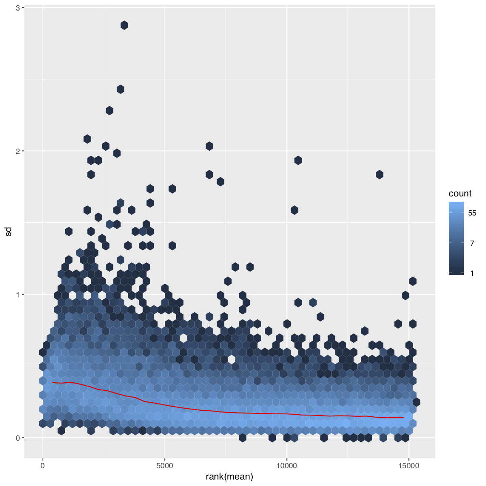
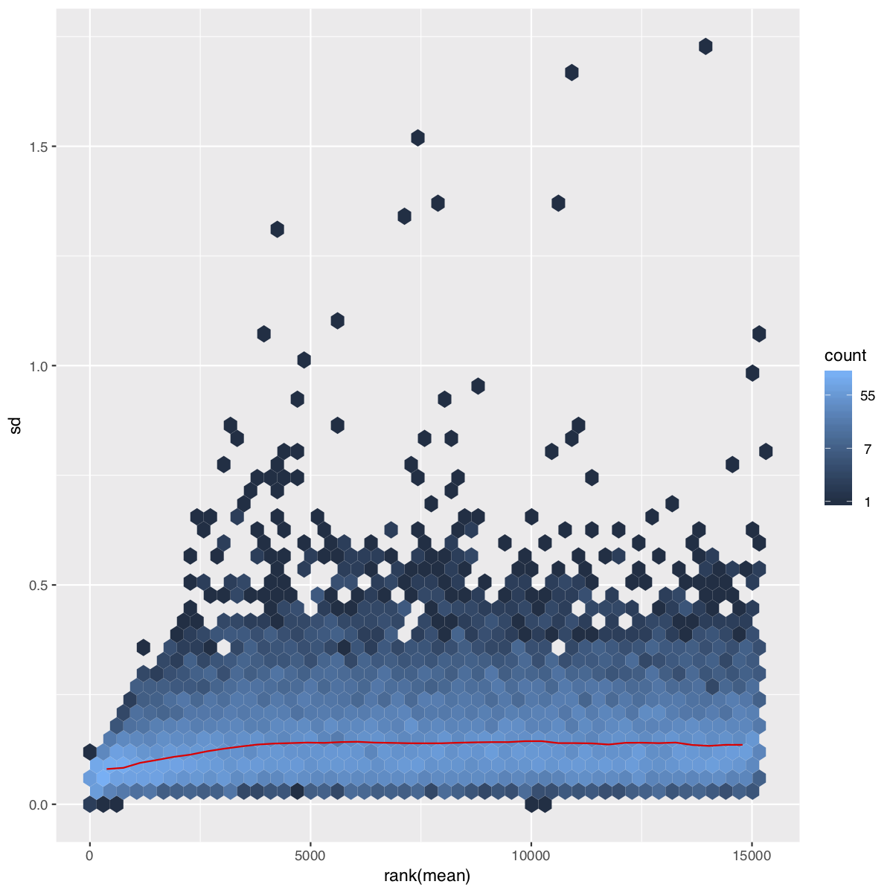
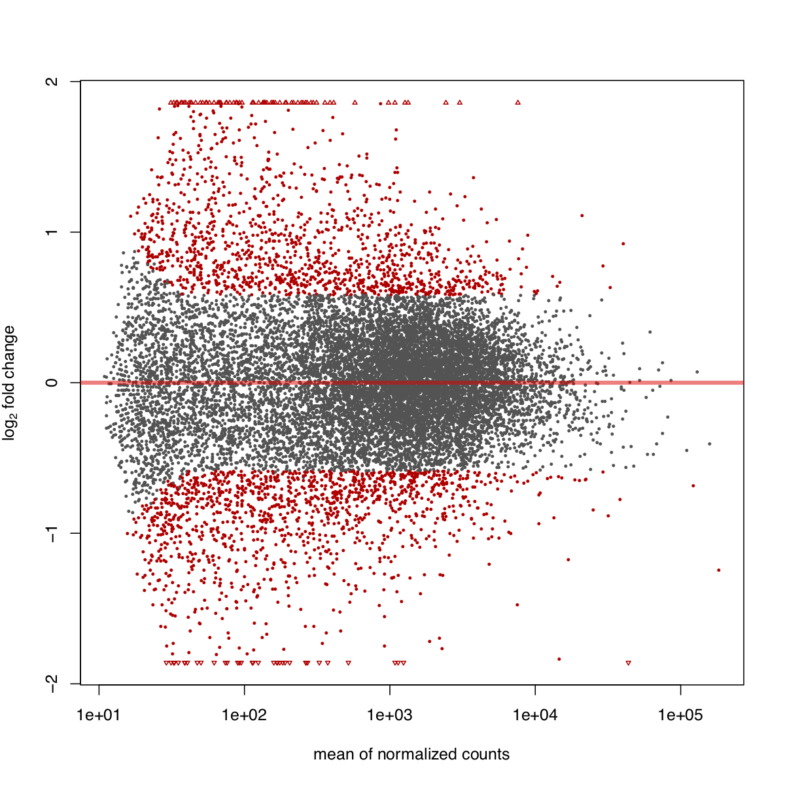
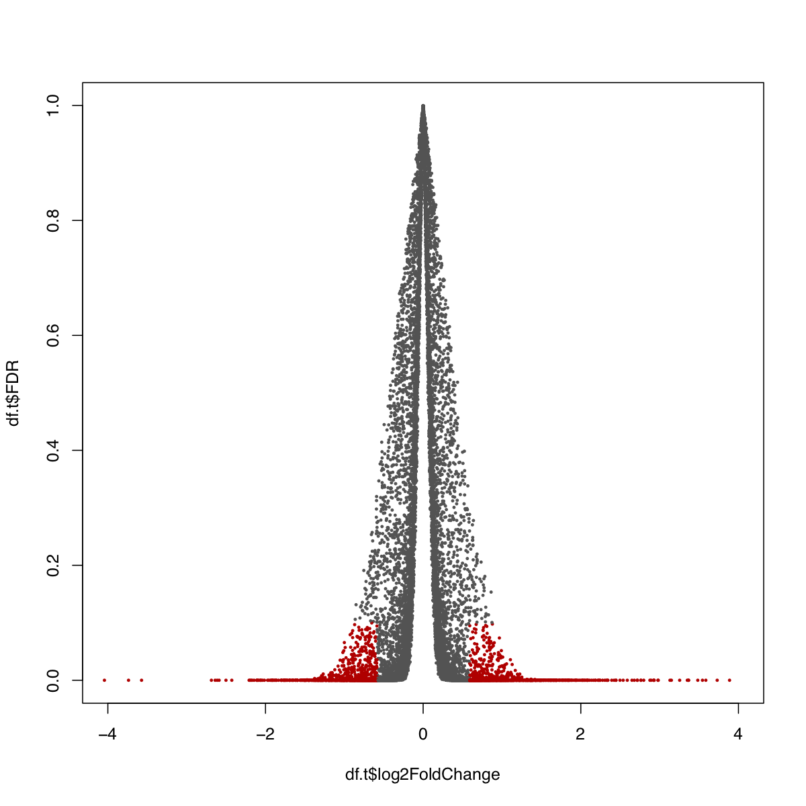
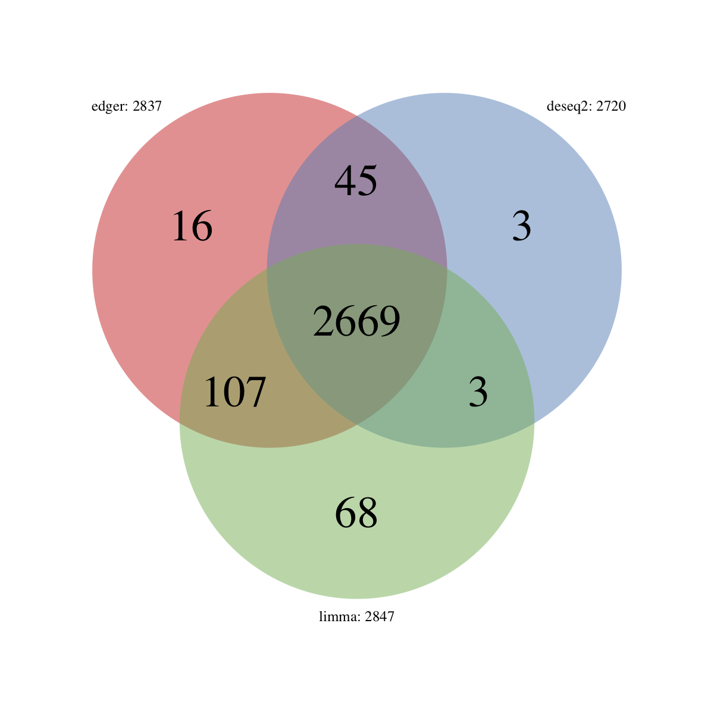
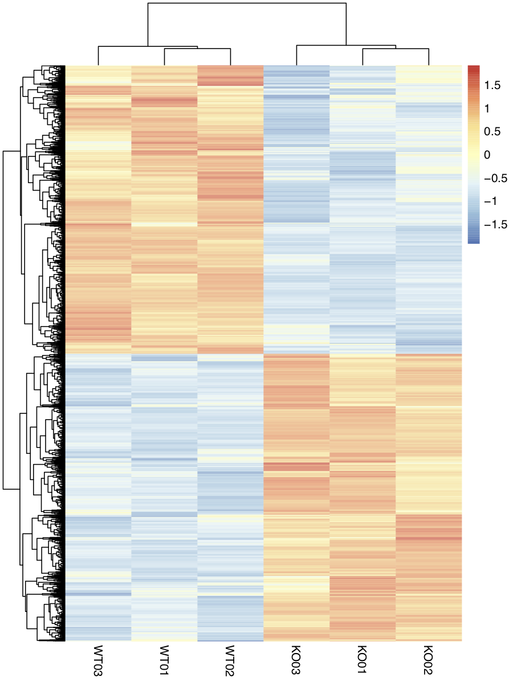
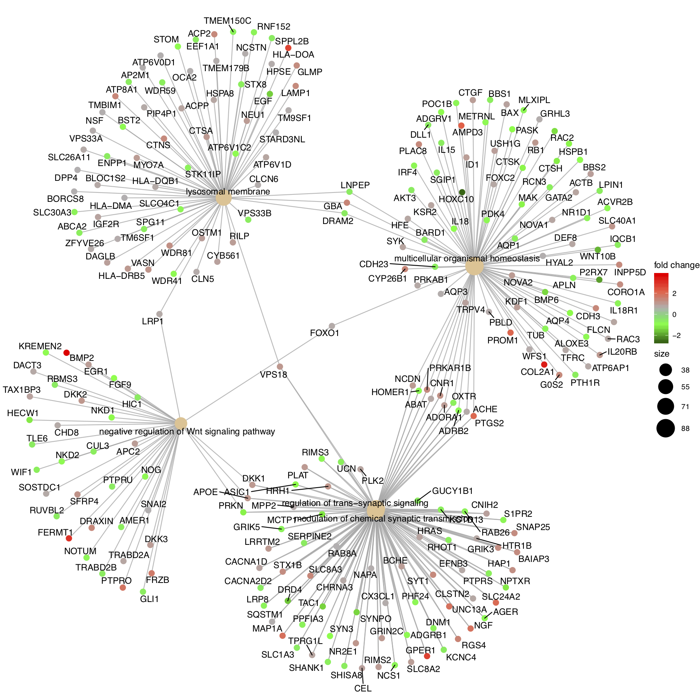
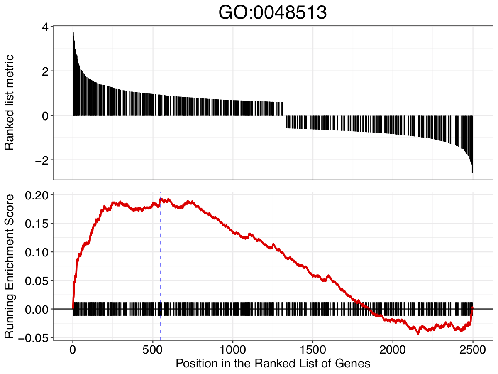

```{r, results='hide', echo=FALSE, message=FALSE, warning=FALSE}
library("knitr")
library("kableExtra")
library("png")
library("grid")
library("dplyr")
library("captioner")
```

<!--
* Notes
    - add [MultiQC](http://multiqc.info/)
    - change grch38/hg38
    - incorporate other pipeline (ChIP-seq, WGBS, WGS/WXS)
    - Docker + WDL/CWL
-->


## <a name="Top"/>


## CRI RNAseq Pipelines
- [CRI-RNAseq-2016](https://github.com/riyuebao/CRI-Workshop-Nov2016-RNAseq/blob/master/Run_RNAseq.tutorial.ipynb) by [Riyue Bao](http://cri.uchicago.edu/people/#bao). Last modified on **November 12, 2016**.
- [CRI-RNAseq-2014](https://wiki.uchicago.edu/pages/viewpage.action?pageId=95855827) by [Lei Huang](http://cri.uchicago.edu/people/#huang). Last modified on **Apr 29, 2014**.


## **<span style="color:red">RUN AS PRACTICE</span>**

> 
> **Pipeline package is available on <span style="color:red">[CRI Bioinformatics FTP](ftp://logia.cri.uchicago.edu/bioinformatics/tutorials/Nov2018/CRI-BIO-646-BMB-RKeenan.tgz)</span>**
> 

The [Center for Research Informatics](http://cri.uchicago.edu/) (CRI) provides computational resources and expertise in biomedical informatics for researchers in the Biological Sciences Division (BSD) of the University of Chicago. 

<!--
This workshop is part of a series of [monthly training events](http://cri.uchicago.edu/seminar-series/) focusing on using the University of Chicago’s computational resources to analyze Next-Generation Sequencing and Microarray data.
-->

As a [bioinformatics core](http://cri.uchicago.edu/bioinformatics/), we are actively improving our pipelines and expanding pipeline functions. The tutorials will be updated in a timely manner but may not reflect the newest updates of the pipelines. Stay tuned with us for the latest pipeline release.

If you have any questions, comments, or suggestions, feel free to contact our core at bioinformatics@bsd.uchicago.edu or one of our bioinformaticians.


* [Quick Start](#Quick)
* [Introduction](#Intro)
* [Work Flow](#Work)
* [Data Description](#Data)
* [Prerequisites](#Pre)
    + [Login and Setup Tutorial Working Directory](#Login)
* [Pipeline Steps](#Steps)
    + Step 1: [Quality Control](#ReadQC)
    + Step 2-1: [Read Alignment](#Aln)
    + Step 2-2: [Alignment QC](#AlnQC)
    + Step 3: [Expression Quantification](#Quant)
    + Step 4-1: [Identification of Differentially Expressed Genes (DEGs)](#DEG)
    + Step 4-2: [DEG Statistics](#LociStat)
    + Step 5: [Sample Correlation](#QuantQC)
    + Step 6: [Heat Map](#HeatMap)
    + Step 7: [Functional Enrichment Analysis](#GSEA)
* [BigDataScript Report](#BDS)
* [Reference](#Ref)


## <a name="Quick"/>Quick Start | [Top](#Top)

1. modify the generator script **Build_RNAseq.CRI-BIO-646.sh** accordingly
    1. project="PROJECT_AS_PREFIX" (e.g., **CRI-BIO-646** which is used as a prefix of metadata file **CRI-BIO-646**.metadata.txt and configuration file **CRI-BIO-646**.pipeline.yaml)
    2. padding="DIRECTORY_NAME_CONTAINING_PROJECT_DATA" (e.g., **CRI-BIO-646** which is the folder name to accommodate metadata file, configuration file, sequencing data folder, and references folder)
2. prepare metadata file as the example **[CRI-BIO-646.metadata.txt](CRI-BIO-646.metadata.txt)**
    1. **Single End (SE)** Library
        1. Set Flavor column as 1xReadLength (e.g., 1x50)
        2. Set Seqfile1 column as the file name of the repective sequencing file
    2. **Paired End (PE)** Library
        1. Set Flavor column as 2xReadLength (e.g., 2x50)
        2. Set Seqfile1 column as the file name of the repective read 1 (R1) sequencing file
        3. Set an additional column named '**Seqfile2**' as the file name of the repective read 2 (R2) sequencing file
    3. **Non strand-specific** Library
        1. Set LibType column to NS
    4. **Strand-specific** Library
        1. Inquire the library type from your seuqencing center and set LibType column to FR (the left-most end of the fragment (in transcript coordinates, or the first-strand synthesis) is the first sequenced) or RF (the right-most end of the fragment (in transcript coordinates) is the first sequenced, or the second-strand synthesis). You can read this [blog](http://onetipperday.sterding.com/2012/07/how-to-tell-which-library-type-to-use.html) for more details of strand-specific RNA-seq.
3. prepare reference files as the example reference hg38 under **[/gpfs/data/bioinformatics/cri_rnaseq_2018_ex/example/references/v28_92_GRCh38.p12)**
4. prepare pre-built STAR index files as the example reference hg38 under **[/gpfs/data/bioinformatics/cri_rnaseq_2018_ex/example/references/v28_92_GRCh38.p12/STAR)**


## <a name="Intro"/>Introduction | [Top](#Top)


RNA sequencing (RNA-seq) is a revolutionary approach that uses the next-generation sequencing technologies to detect and quantify expressed transcripts in biological samples. Compared to other methods such as microarrays, RNA-seq provides a more unbiased assessment of the full range of transcripts and their isoforms with a greater dynamic range in expression quantification.

In this tutorial, you will learn how to use the CRI's RNA-seq pipeline (available on both [CRI HPC cluster](http://cri.uchicago.edu/hpc/) and [GitHub](https://github.com/wenching/CRI-BIO-646-MED-YLi-CRIRnaSeqPipeline.git))) to analyze Illumina RNA sequencing data. The tutorial comprises the following Steps:

* Assess the sequencing data quality using [FastQC](https://www.bioinformatics.babraham.ac.uk/projects/fastqc/)
* Align the short reads to the target genome (e.g., Human) using [STAR](https://github.com/alexdobin/STAR)
* Measure alignment result using [Picard](https://broadinstitute.github.io/picard/) and [RSeQC](http://rseqc.sourceforge.net/)
* Quantify expression using [Subread](http://subread.sourceforge.net/)::[featureCounts](http://bioinf.wehi.edu.au/featureCounts/)
* Identify differentially expressed genes using [edgeR](https://bioconductor.org/packages/release/bioc/html/edgeR.html), [DESeq2](https://bioconductor.org/packages/release/bioc/html/DESeq2.html), [limma](https://bioconductor.org/help/search/index.html?q=limma/)
* Heat Map using [pheatmap](https://cran.r-project.org/web/packages/pheatmap/index.html)
* Conduct functional enrichment analysis using [clusterProfiler](https://bioconductor.org/packages/release/bioc/html/clusterProfiler.html)

By the end of this tutorial, you will:

* Understand the basics of RNA-seq experimental design
* Be familiar with the common data formats and standards in RNA-seq analysis
* Know computational tools for RNA-seq data processing
* Be able to align short sequence reads on a reference genome
* Be able to perform the basic analysis such as gene quantification and differential expression analysis

This tutorial is based on CRI's high-performance computing (HPC) cluster. If you are not familiar with this newly assembled cluster, a concise user's guide can be found [here](http://cri.uchicago.edu/wp-content/uploads/2017/04/Gardner-Part-1.pdf).


## <a name="Work"/>Work Folow | [Top](#Top)


The RNA-seq data used in this tutorial are from **CRI-BIO-646-BMB-RKeenan**.

In this tutorial, we use the sequencing reads in the project CRI-BIO-646 in mouse as example.
The sample information are saved in the file **<span style="color:red">`CRI-BIO-646.metadata.txt`</span>** (see [below](#Data)).


## <a name="Data"/>Data Description | [Top](#Top)

There are six (partial) single-end RNA-seq sequencing libraries will be used as the example dataset In this tutorial.
Their respective sample information is described in the metadata table CRI-BIO-646/**`CRI-BIO-646.metadata.txt`**.

```{r, results='hide', echo=FALSE}
df.metadata <- read.csv(
  file = "../CRI-BIO-646/CRI-BIO-646.metadata.txt",
  header = TRUE,
  sep = "\t",
  check.names = FALSE,
  stringsAsFactors = FALSE
)
```
```{r, results='asis', echo=FALSE}
knitr::kable(df.metadata, format = "html", caption = "Sample Description") %>% 
  kableExtra::kable_styling(bootstrap_options = c("striped", "hover", "condensed", "responsive")) %>% 
  kableExtra::scroll_box(width = "100%", height = "300px")
```


## <a name="Pre"/>Prerequisites | [Top](#Top)


We will use SSH (Secure Shell) to connect to CRI's HPC. SSH now is included or can be installed in all standard operating systems (Windows, Linux, and OS X).


### <a name="Login"/>Login and Setup Tutorial Working Directory | [Top](#Top)


The login procedure varies slightly depending on whether you use a Mac/Unix/Linux computer or a Windows computer.

* Log into one of entry nodes in CRI HPC  
    1. Open a terminal session.  
    2. Connect to the login node of the CRI HPC cluster:  
        ```{r, engine='bash', eval=FALSE}
        $ ssh -l username@gardner.cri.uchicago.edu
        ```
    3. If it's your first time to log in, you will be asked to accept the ssh key. Type "**yes**"  
    4. Type in the password when prompted  

        > Make sure that you replace **_<span style="color:red">`username`</span>_** with your login name.

>  
> - **<span style="color:red">CAUTION</span>**
>     - THIS PACKAGE IS LARGE, PLEASE DO NOT DOWNLOAD IT TO YOUR HOME DIRECTORY
>     - USE OTHER LOCATION LIKE /gpfs/data/bioinformatics/username
>  

* Set up a tutorial directory  
    1. You should be in your home directory after logging in  
        ```{r, engine='bash', eval=FALSE}
        $ pwd
        /home/username
        ```
    2. Instead of downloading the pipeline package to your local home directory, use other location like /gpfs/data/bioinformatics/username
        ```{r, engine='bash', eval=FALSE}
        $ cd /gpfs/data/bioinformatics/username; pwd
        /gpfs/data/bioinformatics/username
        ```

* Download the pipeline package  
    1. One way to download the pipeline package via `git clone`  
        ```{r, engine='bash', eval=FALSE}
        $ cp ftp://logia.cri.uchicago.edu/bioinformatics/tutorials/Nov2018/CRI-BIO-646-BMB-RKeenan.tgz .
        ```
    2. Uncompress the tarball file  
        ```{r, engine='bash', eval=FALSE}
        $ tar -zxvf CRI-BIO-646-BMB-RKeenan.tgz
        ```
    3. Change working directory to pipeline dirctory  
        ```{r, engine='bash', eval=FALSE}
        $ cd CRI-BIO-646-BMB-RKeenan
        $ tree -d
        |-- CRI-BIO-646
        |   |-- data
        |   |   |-- 180216_K00242_0355_AHT7NTBBXX-RKeenan-AA-RS10
        |   |   |   `-- FastQ
        |   |   `-- 180223_K00242_0357_AHT37VBBXX-RKeenan-AA-RS10
        |   |       `-- FastQ
        |   `-- references
        |       `-- v28_92_GRCh38.p12
        |           `-- STAR
        |-- SRC
        |   |-- Python
        |   |   |-- lib
        |   |   |-- module
        |   |   `-- util
        |   `-- R
        |       |-- module
        |       `-- util
        `-- docs
            `-- IMG
        ```

* File structure  
    - Raw sequencing data files (*.fastq.gz) are located at **`CRI-BIO-646/data/`**  
        ```{r, engine='bash', eval=FALSE}
        $ tree CRI-BIO-646/data/
        |-- 180216_K00242_0355_AHT7NTBBXX-RKeenan-AA-RS10
        |   `-- FastQ
        |       |-- BK-AA-1_S11_L007_R1_001.fastq.gz
        |       |-- BK-AA-2_S12_L007_R1_001.fastq.gz
        |       |-- BK-AA-3_S13_L007_R1_001.fastq.gz
        |       |-- BK-AA-4_S14_L007_R1_001.fastq.gz
        |       |-- BK-AA-5_S15_L007_R1_001.fastq.gz
        |       `-- BK-AA-6_S16_L007_R1_001.fastq.gz
        `-- 180223_K00242_0357_AHT37VBBXX-RKeenan-AA-RS10
            `-- FastQ
                |-- BK-AA-1_S11_L007_R1_001.fastq.gz
                |-- BK-AA-2_S12_L007_R1_001.fastq.gz
                |-- BK-AA-3_S13_L007_R1_001.fastq.gz
                |-- BK-AA-4_S14_L007_R1_001.fastq.gz
                |-- BK-AA-5_S15_L007_R1_001.fastq.gz
                `-- BK-AA-6_S16_L007_R1_001.fastq.gz
        ```
    - Genome data are located at **`/gpfs/data/bioinformatics/ReferenceData/cri_rnaseq_2018/vM18_93_GRCm38.p6`**  
        ```{r, engine='bash', eval=FALSE}
        $ tree /gpfs/data/bioinformatics/cri_rnaseq_2018_ex/example/references/v28_92_GRCh38.p12
        |-- GRCh38_rRNA.bed
        |-- GRCh38_rRNA.bed.interval_list
        |-- STAR
        |   |-- Genome
        |   |-- Log.out
        |   |-- SA
        |   |-- SAindex
        |   |-- chrLength.txt
        |   |-- chrName.txt
        |   |-- chrNameLength.txt
        |   |-- chrStart.txt
        |   |-- exonGeTrInfo.tab
        |   |-- exonInfo.tab
        |   |-- geneInfo.tab
        |   |-- genomeParameters.txt
        |   |-- run_genome_generate.logs
        |   |-- sjdbInfo.txt
        |   |-- sjdbList.fromGTF.out.tab
        |   |-- sjdbList.out.tab
        |   `-- transcriptInfo.tab
        |-- genes.gtf
        |-- genes.gtf.bed12
        |-- genes.refFlat.txt
        |-- genome.chrom.sizes
        |-- genome.dict
        `-- genome.fa
        ```

* Pipeline/project related files  
    - project related files (i.e., metadata & configuration file) as used in this tutorial are located under **`CRI-BIO-646/`**  
        ```{r, engine='bash', eval=FALSE}
        $ ls -l CRI-BIO-646.*
        |-- CRI-BIO-646.metadata.txt
        |-- CRI-BIO-646.pipeline.yaml
        ```
        + Here are the first few lines in the configuration example file CRI-BIO-646/**`CRI-BIO-646.pipeline.yaml`**
            ```{r, engine='bash', echo=FALSE, comment=''}
            head -n20 "../CRI-BIO-646/CRI-BIO-646.pipeline.yaml"
            ```
        
        >   
        > When running on another dataset, you will need to modify these <span style="color:red">`two files`</span> and the master pipeline script (i.e., <span style="color:red">`Build_RNAseq.CRI-BIO-646.sh`</span>) (as described below) accordingly.  
        >   
        > For instance, if you would like to turn off the DE analysis tool limma, you can set the respecitve paramter to 'False' in configuration file  
        >     - run_limma: False  
        >   
        
        >  
        > For metadata file, you might pay attendtion on the following settings
        > 1. **Single End (SE)** Library
        >     1. Set Flavor column as 1xReadLength (e.g., 1x50)
        >     2. Set Seqfile1 column as the file name of the repective sequencing file
        > 2. **Paired End (PE)** Library
        >     1. Set Flavor column as 2xReadLength (e.g., 2x50)
        >     2. Set Seqfile1 column as the file name of the repective read 1 (R1) sequencing file
        >     3. Set an additional column named '**Seqfile2**' as the file name of the repective read 2 (R2) sequencing file
        > 3. **Non strand-specific** Library
        >     1. Set LibType column to NS
        > 4. **Strand-specific** Library
        >     1. Inquire the library type from your seuqencing center and set LibType column to FR (the left-most end of the fragment (in transcript coordinates, or the first-strand synthesis) is the first sequenced) or RF (the right-most end of the fragment (in transcript coordinates) is the first sequenced, or the second-strand synthesis). You can read this [blog](http://onetipperday.sterding.com/2012/07/how-to-tell-which-library-type-to-use.html) for more details of strand-specific RNA-seq.
        >  
    
    - Master pipeline script  
        ```{r, engine='bash', eval=FALSE}
        $ cat Build_RNAseq.CRI-BIO-646.sh
        ## build pipeline scripts
        
        now=$(date +"%m-%d-%Y_%H:%M:%S")
        
        ## project info
        project="CRI-BIO-646"
        SubmitRNAseqExe="Submit_${PWD##*/}.sh"
        padding="CRI-BIO-646/"
        
        ## command
        echo "START" `date` " Running build_rnaseq.py"
        python3 SRC/Python/build_rnaseq.py \
        	--projdir $PWD \
        	--metadata $PWD/${padding}$project.metadata.txt \
        	--config $PWD/${padding}$project.pipeline.yaml \
        	--systype cluster \
        	--threads 8 \
        	--log_file $PWD/Build_RNAseq.$project.$now.log
        
        ## submit pipeline master script
        echo "START" `date` " Running $SubmitRNAseqExe"
        echo "bash $SubmitRNAseqExe"
        
        echo "END" `date`
        ```
        
        >   
        > Basically, when running on your own dataset, you will need to modify this master pipeline script (i.e., <span style="color:red">`Build_RNAseq.CRI-BIO-646.sh`</span>) accordingly.    
        >   
        > For instance, you can change respective parameters as follows.  
        >     - project="PROJECT_AS_PREFIX" (e.g., **CRI-BIO-646** which is used as a prefix of metadata file **CRI-BIO-646**.metadata.txt and configuration file **CRI-BIO-646**.pipeline.yaml)  
        >     - padding="DIRECTORY_NAME_CONTAINING_PROJECT_DATA" (e.g., **CRI-BIO-646** which is the folder name to accommodate metadata file, configuration file, sequencing data folder, and references folder)  
        >   


## <a name="Steps"/>Pipeline Steps | [Top](#Top)

* Before running, you need to know

    >
    > The master BigDataScript script can be <span style="color:red">`ONLY run on a head/entry node`</span> other than any other compuatation node.
    > But, you can step by step run individual sub-task bash scripts in any computation node interactively.
    >

* Generate sub-task scirpts of the pipepline
    ```{r, engine='bash', eval=FALSE}
    # load modules
    $ module purge;module load gcc udunits R/3.5.0 python/3.6.0; module update

    # This step is optional but it will install all necessary R packages ahead.
    # In case the pipeline was terminated due to the failure of R package installation later when running the pipeline.
    # A successful execution result will show the package versions of all necessary packages from devtools to pheatmap
    $ Rscript --vanilla SRC/R/util/prerequisite.packages.R

    # create directories and generate all necessary scripts
    $ bash Build_RNAseq.CRI-BIO-646.sh
    ```

    + this step will execute **`SRC/Python/build_rnaseq.py`** using python3 to generate all sub-task bash scripts and directories according to the provided metadata and configuration files (i.e., CRI-BIO-646/**`CRI-BIO-646.metadata.txt`** and CRI-BIO-646/**`CRI-BIO-646.pipeline.yaml`** )
        ```{r, engine='bash', eval=FALSE}
        $ tree -d RNAseq
        |-- Aln
        |   `-- star
        |       |-- KO01
        |       |   |-- BK-AA-4_S14_L007_R355
        |       |   `-- BK-AA-4_S14_L007_R357
        |       |-- KO02
        |       |   |-- BK-AA-5_S15_L007_R355
        |       |   `-- BK-AA-5_S15_L007_R357
        |       |-- KO03
        |       |   |-- BK-AA-6_S16_L007_R355
        |       |   `-- BK-AA-6_S16_L007_R357
        |       |-- WT01
        |       |   |-- BK-AA-1_S11_L007_R355
        |       |   `-- BK-AA-1_S11_L007_R357
        |       |-- WT02
        |       |   |-- BK-AA-2_S12_L007_R355
        |       |   `-- BK-AA-2_S12_L007_R357
        |       `-- WT03
        |           |-- BK-AA-3_S13_L007_R355
        |           `-- BK-AA-3_S13_L007_R357
        |-- AlnQC
        |   |-- picard
        |   |   `-- star
        |   |       |-- KO01
        |   |       |   `-- tmp
        |   |       |-- KO02
        |   |       |   `-- tmp
        |   |       |-- KO03
        |   |       |   `-- tmp
        |   |       |-- WT01
        |   |       |   `-- tmp
        |   |       |-- WT02
        |   |       |   `-- tmp
        |   |       `-- WT03
        |   |           `-- tmp
        |   `-- rseqc
        |       `-- star
        |           |-- KO01
        |           |   `-- tmp
        |           |-- KO02
        |           |   `-- tmp
        |           |-- KO03
        |           |   `-- tmp
        |           |-- WT01
        |           |   `-- tmp
        |           |-- WT02
        |           |   `-- tmp
        |           `-- WT03
        |               `-- tmp
        |-- DEG
        |   |-- deseq2
        |   |   `-- featurecounts
        |   |       `-- star
        |   |-- edger
        |   |   `-- featurecounts
        |   |       `-- star
        |   `-- limma
        |       `-- featurecounts
        |           `-- star
        |-- LociStat
        |   `-- featurecounts
        |       `-- star
        |           `-- CRI-BIO-646-BMB-RKeenan
        |-- PostAna
        |   |-- clusterprofiler
        |   |   `-- featurecounts
        |   |       `-- star
        |   |           `-- CRI-BIO-646-BMB-RKeenan
        |   `-- pheatmap
        |       `-- featurecounts
        |           `-- star
        |               `-- CRI-BIO-646-BMB-RKeenan
        |-- QuantQC
        |   `-- featurecounts
        |       `-- star
        |-- Quantification
        |   `-- featurecounts
        |       `-- star
        |           |-- KO01
        |           |-- KO02
        |           |-- KO03
        |           |-- WT01
        |           |-- WT02
        |           `-- WT03
        |-- RawReadQC
        |   |-- KO01
        |   |   |-- BK-AA-4_S14_L007_R355
        |   |   |   `-- BK-AA-4_S14_L007_R1_001_fastqc
        |   |   |       |-- Icons
        |   |   |       `-- Images
        |   |   `-- BK-AA-4_S14_L007_R357
        |   |       `-- BK-AA-4_S14_L007_R1_001_fastqc
        |   |           |-- Icons
        |   |           `-- Images
        |   |-- KO02
        |   |   |-- BK-AA-5_S15_L007_R355
        |   |   |   `-- BK-AA-5_S15_L007_R1_001_fastqc
        |   |   |       |-- Icons
        |   |   |       `-- Images
        |   |   `-- BK-AA-5_S15_L007_R357
        |   |       `-- BK-AA-5_S15_L007_R1_001_fastqc
        |   |           |-- Icons
        |   |           `-- Images
        |   |-- KO03
        |   |   |-- BK-AA-6_S16_L007_R355
        |   |   |   `-- BK-AA-6_S16_L007_R1_001_fastqc
        |   |   |       |-- Icons
        |   |   |       `-- Images
        |   |   `-- BK-AA-6_S16_L007_R357
        |   |       `-- BK-AA-6_S16_L007_R1_001_fastqc
        |   |           |-- Icons
        |   |           `-- Images
        |   |-- WT01
        |   |   |-- BK-AA-1_S11_L007_R355
        |   |   |   `-- BK-AA-1_S11_L007_R1_001_fastqc
        |   |   |       |-- Icons
        |   |   |       `-- Images
        |   |   `-- BK-AA-1_S11_L007_R357
        |   |       `-- BK-AA-1_S11_L007_R1_001_fastqc
        |   |           |-- Icons
        |   |           `-- Images
        |   |-- WT02
        |   |   |-- BK-AA-2_S12_L007_R355
        |   |   |   `-- BK-AA-2_S12_L007_R1_001_fastqc
        |   |   |       |-- Icons
        |   |   |       `-- Images
        |   |   `-- BK-AA-2_S12_L007_R357
        |   |       `-- BK-AA-2_S12_L007_R1_001_fastqc
        |   |           |-- Icons
        |   |           `-- Images
        |   `-- WT03
        |       |-- BK-AA-3_S13_L007_R355
        |       |   `-- BK-AA-3_S13_L007_R1_001_fastqc
        |       |       |-- Icons
        |       |       `-- Images
        |       `-- BK-AA-3_S13_L007_R357
        |           `-- BK-AA-3_S13_L007_R1_001_fastqc
        |               |-- Icons
        |               `-- Images
        `-- shell_scripts
        ```
* Execute the entire analysis with just one command
    ```{r, engine='bash', eval=FALSE}
    # This will start to run the entire pipeline.
    # You can chekc teh BDS report to know the running status.
    $ bash Submit_CRI-BIO-646-BMB-RKeenan.sh
    ```
    + Again, this step will execute the master BigDataScript script **`Submit_CRI-BIO-646-BMB-RKeenan.bds`**, so you will need to run this command <span style="color:red">**on a head/entry node**</span>.
    
    > 
    > Check running status
    > 1. $ qstat -a
    > 2. tail *.bds.log
    > 
  


### <a name="ReadQC"/>Step 1: Quality Control | [Top](#Top)


For the first step, the pipeline will perform quality assessment on the raw fastq files.

The BDS code snippet for the sample KO01 will look like:

```{r, engine='bash', eval=FALSE}
$ grep -A1 run.RawReadQC.FastQC.BK-AA-4_S14_L007_R355.sh Submit_*.bds
dep( [ '/gpfs/data/bioinformatics/username/CRI-BIO-646-BMB-RKeenan/RNAseq/RawReadQC/KO01/BK-AA-4_S14_L007_R355/BK-AA-4_S14_L007_R1_001_fastqc.zip' ] <- [ '/gpfs/data/bioinformatics/username/CRI-BIO-646-BMB-RKeenan/CRI-BIO-646/data/180216_K00242_0355_AHT7NTBBXX-RKeenan-AA-RS10/FastQ/BK-AA-4_S14_L007_R1_001.fastq.gz' ], cpus := 1, mem := 16*G, timeout := 72*hour, taskName := "FastQC.BK-AA-4_S14_L007_R355") sys bash /gpfs/data/bioinformatics/username/CRI-BIO-646-BMB-RKeenan/RNAseq/shell_scripts/run.RawReadQC.FastQC.BK-AA-4_S14_L007_R355.sh; sleep 2
goal( [ '/gpfs/data/bioinformatics/username/CRI-BIO-646-BMB-RKeenan/RNAseq/RawReadQC/KO01/BK-AA-4_S14_L007_R355/BK-AA-4_S14_L007_R1_001_fastqc.zip' ] )
```

This code chunk will invoke the bash script RNAseq/shell_scripts/**`run.RawReadQC.FastQC.BK-AA-4_S14_L007_R355.sh`** to execute FastQC on the KO01(BK-AA-1_S11_L007_R355) sequencing library.

After the completion of the entire pipeline, you can check FastQC report per individual libraries; for instance, the partial report of KO01 will be as follows or a full [report](result/BK-AA-4_S14_L007_R355_fastqc.html).


You can check [FastQC Help](https://www.bioinformatics.babraham.ac.uk/projects/fastqc/Help/3%20Analysis%20Modules/) for more details about how to interpret a FastQC report.

Or, compare your reports to the example reports provided by FastQC for a [Good Illumina Data](https://www.bioinformatics.babraham.ac.uk/projects/fastqc/good_sequence_short_fastqc.html) or [Bad Illumina Data](https://www.bioinformatics.babraham.ac.uk/projects/fastqc/bad_sequence_fastqc.html).


### <a name="Aln"/>Step 2.1: Read Alignment | [Top](#Top)


In this step, the pipeline will conduct read alignment on the raw fastq files.

The BDS code snippet for the sample KO01 will look like:

```{r, engine='bash', eval=FALSE}
$ grep -A1 run.alignRead.star.BK-AA-4_S14_L007_R355.sh Submit_*.bds
dep( [ '/gpfs/data/bioinformatics/username/CRI-BIO-646-BMB-RKeenan/RNAseq/Aln/star/KO01/BK-AA-4_S14_L007_R355/BK-AA-4_S14_L007_R355.star.bam' ] <- [ '/gpfs/data/bioinformatics/username/CRI-BIO-646-BMB-RKeenan/CRI-BIO-646/data/180216_K00242_0355_AHT7NTBBXX-RKeenan-AA-RS10/FastQ/BK-AA-4_S14_L007_R1_001.fastq.gz' ], cpus := 4, mem := 64*G, timeout := 72*hour, taskName := "star.BK-AA-4_S14_L007_R355") sys bash /gpfs/data/bioinformatics/username/CRI-BIO-646-BMB-RKeenan/RNAseq/shell_scripts/run.alignRead.star.BK-AA-4_S14_L007_R355.sh; sleep 2
goal( [ '/gpfs/data/bioinformatics/username/CRI-BIO-646-BMB-RKeenan/RNAseq/Aln/star/KO01/BK-AA-4_S14_L007_R355/BK-AA-4_S14_L007_R355.star.bam' ] )
```

This code chunk will invoke the bash script RNAseq/shell_scripts/**`run.alignRead.star.BK-AA-4_S14_L007_R355.sh`** to execute STAR on the KO01(BK-AA-4_S14_L007_R355) sequencing library.

After the completion of the entire pipeline, you can check the alignment result of each individual libraries; for instance, the result of KO01(BK-AA-4_S14_L007_R355) will be as follows.

```{r, engine='bash', eval=FALSE}
$ tree RNAseq/Aln/star/KO01/BK-AA-4_S14_L007_R355
RNAseq/Aln/star/KO01/BK-AA-4_S14_L007_R355
|-- BK-AA-4_S14_L007_R355.star.Aligned.sortedByCoord.out.bam
|-- BK-AA-4_S14_L007_R355.star.Log.final.out
|-- BK-AA-4_S14_L007_R355.star.Log.out
|-- BK-AA-4_S14_L007_R355.star.Log.progress.out
|-- BK-AA-4_S14_L007_R355.star.SJ.out.tab
|-- BK-AA-4_S14_L007_R355.star.Unmapped.out.mate1
|-- BK-AA-4_S14_L007_R355.star.bai
|-- BK-AA-4_S14_L007_R355.star.bam -> BK-AA-4_S14_L007_R355.star.Aligned.sortedByCoord.out.bam
`-- run.alignRead.star.BK-AA-4_S14_L007_R355.log
```

You can check a log file (e.g., **RNAseq/Aln/star/KO01/BK-AA-4_S14_L007_R355/`BK-AA-4_S14_L007_R355.star.Log.final.out`**) for more alignment information provided by STAR.

```{r, engine='bash', eval=FALSE}
$ cat RNAseq/Aln/star/KO01/BK-AA-4_S14_L007_R355/BK-AA-4_S14_L007_R355.star.Log.final.out
```
```{r, engine='bash', echo=FALSE}
cat result/*.star.Log.final.out
```


### <a name="AlnQC"/>Step 2.2: Alignment QC | [Top](#Top)


In this step, the pipeline will conduct a QC on alignment result.

The BDS code snippets for the sample KO01 will look like:

```{r, engine='bash', eval=FALSE}
$ grep -A1 run.alnQC.*.star.KO01.*.sh Submit_*.bds
dep( [ '/gpfs/data/bioinformatics/username/CRI-BIO-646-BMB-RKeenan/RNAseq/AlnQC/picard/star/KO01/KO01.star.picard.RNA_Metrics', '/gpfs/data/bioinformatics/username/CRI-BIO-646-BMB-RKeenan/RNAseq/AlnQC/picard/star/KO01/KO01.star.picard.RNA_Metrics.pdf' ] <- [ '/gpfs/data/bioinformatics/username/CRI-BIO-646-BMB-RKeenan/RNAseq/Aln/star/KO01/KO01.star.bai' ], cpus := 4, mem := 32*G, timeout := 72*hour, taskName := "picard.star.KO01") sys bash /gpfs/data/bioinformatics/username/CRI-BIO-646-BMB-RKeenan/RNAseq/shell_scripts/run.alnQC.picard.star.KO01.CollectRnaSeqMetrics.sh; sleep 2
goal( [ '/gpfs/data/bioinformatics/username/CRI-BIO-646-BMB-RKeenan/RNAseq/AlnQC/picard/star/KO01/KO01.star.picard.RNA_Metrics', '/gpfs/data/bioinformatics/username/CRI-BIO-646-BMB-RKeenan/RNAseq/AlnQC/picard/star/KO01/KO01.star.picard.RNA_Metrics.pdf' ] )
--
dep( [ '/gpfs/data/bioinformatics/username/CRI-BIO-646-BMB-RKeenan/RNAseq/AlnQC/rseqc/star/KO01/KO01.star.rseqc.clipping_profile.xls', '/gpfs/data/bioinformatics/username/CRI-BIO-646-BMB-RKeenan/RNAseq/AlnQC/rseqc/star/KO01/KO01.star.rseqc.clipping_profile.r', '/gpfs/data/bioinformatics/username/CRI-BIO-646-BMB-RKeenan/RNAseq/AlnQC/rseqc/star/KO01/KO01.star.rseqc.clipping_profile.pdf' ] <- [ '/gpfs/data/bioinformatics/username/CRI-BIO-646-BMB-RKeenan/RNAseq/Aln/star/KO01/KO01.star.bai' ], cpus := 8, mem := 64*G, timeout := 72*hour, taskName := "rseqc.star.KO01") sys bash /gpfs/data/bioinformatics/username/CRI-BIO-646-BMB-RKeenan/RNAseq/shell_scripts/run.alnQC.rseqc.star.KO01.clipping_profile.py.sh; sleep 2
goal( [ '/gpfs/data/bioinformatics/username/CRI-BIO-646-BMB-RKeenan/RNAseq/AlnQC/rseqc/star/KO01/KO01.star.rseqc.clipping_profile.xls', '/gpfs/data/bioinformatics/username/CRI-BIO-646-BMB-RKeenan/RNAseq/AlnQC/rseqc/star/KO01/KO01.star.rseqc.clipping_profile.r', '/gpfs/data/bioinformatics/username/CRI-BIO-646-BMB-RKeenan/RNAseq/AlnQC/rseqc/star/KO01/KO01.star.rseqc.clipping_profile.pdf' ] )
--
dep( [ '/gpfs/data/bioinformatics/username/CRI-BIO-646-BMB-RKeenan/RNAseq/AlnQC/rseqc/star/KO01/KO01.star.rseqc.infer_experiment.txt' ] <- [ '/gpfs/data/bioinformatics/username/CRI-BIO-646-BMB-RKeenan/RNAseq/Aln/star/KO01/KO01.star.bai' ], cpus := 8, mem := 64*G, timeout := 72*hour, taskName := "rseqc.star.KO01") sys bash /gpfs/data/bioinformatics/username/CRI-BIO-646-BMB-RKeenan/RNAseq/shell_scripts/run.alnQC.rseqc.star.KO01.infer_experiment.py.sh; sleep 2
goal( [ '/gpfs/data/bioinformatics/username/CRI-BIO-646-BMB-RKeenan/RNAseq/AlnQC/rseqc/star/KO01/KO01.star.rseqc.infer_experiment.txt' ] )
```

This code chunk will invoke few bash scripts (e.g., RNAseq/shell_scripts/**`run.alnQC.picard.star.KO01.CollectRnaSeqMetrics.sh`**, **`run.alnQC.rseqc.star.KO01.clipping_profile.py.sh`**, and **`run.alnQC.rseqc.star.KO01.infer_experiment.py.sh`**) to execute alignment QC tools (i.e., [Picard](https://broadinstitute.github.io/picard/) and [RSeQC](http://rseqc.sourceforge.net/)) on the sample KO01.

After the completion of the entire pipeline, you can check the alignment QC results of each individual samples; for instance, the results of KO01 will be as follows.

```{r, engine='bash', eval=FALSE}
$ tree RNAseq/AlnQC/*/star/KO01
RNAseq/AlnQC/picard/star/KO01
|-- KO01.star.picard.RNA_Metrics
|-- KO01.star.picard.RNA_Metrics.pdf
|-- run.alnQC.picard.star.KO01.CollectRnaSeqMetrics.log
`-- tmp
RNAseq/AlnQC/rseqc/star/KO01
|-- KO01.star.rseqc.clipping_profile.pdf
|-- KO01.star.rseqc.clipping_profile.r
|-- KO01.star.rseqc.clipping_profile.xls
|-- KO01.star.rseqc.infer_experiment.txt
|-- run.alnQC.rseqc.star.KO01.clipping_profile.py.log
`-- tmp
```

You can check alignment statistics (e.g., **RNAseq/AlnQC/picard/star/KO01/`KO01.star.picard.RNA_Metrics`**) for more information provided by [Picard](https://broadinstitute.github.io/picard/).

```{r, engine='bash', eval=FALSE}
$ head RNAseq/AlnQC/picard/star/KO01/KO01.star.picard.RNA_Metrics
```
```{r, engine='bash', echo=FALSE}
head result/KO01.star.picard.RNA_Metrics
```

Or, the respective coverage plot of the sample KO01 produced by [Picard](https://broadinstitute.github.io/picard/) will be as follows.


There are two alignment measurements performed using [RSeQC](http://rseqc.sourceforge.net).

1. [clipping_profile.py](http://rseqc.sourceforge.net/#clipping-profile-py)
    * Calculate the distributions of clipped nucleotides across reads
2. [infer_experiment.py](http://rseqc.sourceforge.net/#infer-experiment-py)
    * Use to “guess” how RNA-seq sequencing was configured, particularly how reads were stranded for strand-specific RNA-seq data, through comparing the “strandedness of reads” with the “strandedness of transcripts”.
<!-- 3. [RPKM_saturation.py](http://rseqc.sourceforge.net/#rpkm-saturation-py) -->
<!--     * Calculate RPKM value using a series of resampled subsets from total RNA reads to check if the current sequencing depth was saturated or not (or if the RPKM values were stable or not) in terms of genes’ expression estimation -->

The results will be as follows. Please check the [RSeQC](http://rseqc.sourceforge.net) website for more measurements and details.


```{r, engine='bash', eval=FALSE}
$cat RNAseq/AlnQC/rseqc/star/KO01/KO01.star.rseqc.infer_experiment.txt
```
```{r, engine='bash', echo=FALSE}
cat result/KO01.star.rseqc.infer_experiment.txt
```

Here, you can confirm again the sample KO01 is a single-end, strand-specific library using the second-strand synthesis.


### <a name="Quant"/>Step 3: Expression Quantification | [Top](#Top)

In this step, the pipeline will conduct expression quantification over alignments.

The BDS code snippet for the sample KO01 will look like:

```{r, engine='bash', eval=FALSE}
$ grep -A1 run.quant.featurecounts.star.KO01.sh Submit_*.bds
dep( [ '/gpfs/data/bioinformatics/username/CRI-BIO-646-BMB-RKeenan/RNAseq/Quantification/featurecounts/star/KO01/KO01.star.featurecounts.count' ] <- [ '/gpfs/data/bioinformatics/username/CRI-BIO-646-BMB-RKeenan/RNAseq/Aln/star/KO01/KO01.star.bai' ], cpus := 4, mem := 32*G, timeout := 72*hour, taskName := "featurecounts.star.KO01") sys bash /gpfs/data/bioinformatics/username/CRI-BIO-646-BMB-RKeenan/RNAseq/shell_scripts/run.quant.featurecounts.star.KO01.sh; sleep 2
goal( [ '/gpfs/data/bioinformatics/username/CRI-BIO-646-BMB-RKeenan/RNAseq/Quantification/featurecounts/star/KO01/KO01.star.featurecounts.count' ] )
```

This code chunk will invoke the bash script (e.g., RNAseq/shell_scripts/**`run.quant.featurecounts.star.KO01.sh`**) to execute expression quantification tool (i.e., [Subread](http://subread.sourceforge.net/)::[featureCounts](http://bioinf.wehi.edu.au/featureCounts/) on the sample KO01.

After the completion of the entire pipeline, you can check the quantification results of each individual samples; for instance, the results of KO01 will be as follows.

```{r, engine='bash', eval=FALSE}
$ tree RNAseq/Quantification/featurecounts/star/KO01
RNAseq/Quantification/featurecounts/star/KO01
|-- KO01.star.featurecounts.count
|-- KO01.star.featurecounts.count.jcounts
|-- KO01.star.featurecounts.count.summary
`-- run.quant.featurecounts.star.KO01.log
```

You can check quantification statistics (e.g., **RNAseq/Quantification/featurecounts/star/KO01`KO01.star.featurecounts.count.summary`**) for more information provided by [Subread](http://subread.sourceforge.net/)::[featureCounts](http://bioinf.wehi.edu.au/featureCounts/)

```{r, engine='bash', eval=FALSE}
$ cat RNAseq/Quantification/featurecounts/star/KO01/KO01.star.featurecounts.count.summary
```
```{r, engine='bash', echo=FALSE}
cat result/KO01.star.featurecounts.count.summary
```

Or, the top 10 most abundant genes in the sample KO01 will be as follows.

```{r, engine='bash', eval=FALSE}
$ cat <(head -n2 RNAseq/Quantification/featurecounts/star/KO01/KO01.star.featurecounts.count | tail -n+2 | cut -f1,7) <(cut -f1,7 RNAseq/Quantification/featurecounts/star/KO01/KO01.star.featurecounts.count | sort -k2,2nr | head)
```
```{r, results='hide', echo=FALSE}
df.count <- read.csv(
  file = "result/KO01.star.featurecounts.count",
  header = TRUE,
  sep = "\t",
  comment.char = "#",
  check.names = FALSE,
  stringsAsFactors = FALSE
)

df.count.t <- apply(
  df.count,
  2,
  function(x) {
    gsub(";.+$", "", x)
  }
)

df.count.t[, "End"] <-
  gsub("^.+;", "", df.count[, "End"])

df.count <- df.count.t

colnames(df.count)[ncol(df.count)] <-
  basename(dirname(colnames(df.count)[ncol(df.count)]))

df.count <-
  head(
    df.count[order(as.numeric(df.count[, ncol(df.count)]), decreasing = TRUE), ],
    n = 10
  )
```
```{r, results='asis', echo=FALSE}
knitr::kable(df.count, format = "html", caption = "Top 10 most abundant genes in KO01") %>%
  kableExtra::kable_styling(bootstrap_options = c("striped", "hover", "condensed", "responsive")) %>%
  kableExtra::scroll_box(width = "100%", height = "300px")
```


### <a name="DEG"/>Step 4-1: Identify Differentially Expressed Genes (DEGs) | [Top](#Top)


In this step, the pipeline will identify differentially expressed genes (DEG) according to the alignment result files (i.e., BAM files) after the alignment step.

The BDS code snippets for the example dataset will look like:

```{r, engine='bash', eval=FALSE}
$ grep -A1 run.call.*.featurecounts.star.*.sh Submit_*.bds
dep( [ '/gpfs/data/bioinformatics/username/CRI-BIO-646-BMB-RKeenan/RNAseq/DEG/edger/featurecounts/star/CRI-BIO-646-BMB-RKeenan.star.featurecounts.edger.count.txt', '/gpfs/data/bioinformatics/username/CRI-BIO-646-BMB-RKeenan/RNAseq/DEG/edger/featurecounts/star/CRI-BIO-646-BMB-RKeenan.star.featurecounts.edger.test.DEG.txt' ] <- [ '/gpfs/data/bioinformatics/username/CRI-BIO-646-BMB-RKeenan/RNAseq/Quantification/featurecounts/star/WT01/WT01.star.featurecounts.count', '/gpfs/data/bioinformatics/username/CRI-BIO-646-BMB-RKeenan/RNAseq/Quantification/featurecounts/star/WT02/WT02.star.featurecounts.count', '/gpfs/data/bioinformatics/username/CRI-BIO-646-BMB-RKeenan/RNAseq/Quantification/featurecounts/star/WT03/WT03.star.featurecounts.count', '/gpfs/data/bioinformatics/username/CRI-BIO-646-BMB-RKeenan/RNAseq/Quantification/featurecounts/star/KO01/KO01.star.featurecounts.count', '/gpfs/data/bioinformatics/username/CRI-BIO-646-BMB-RKeenan/RNAseq/Quantification/featurecounts/star/KO02/KO02.star.featurecounts.count', '/gpfs/data/bioinformatics/username/CRI-BIO-646-BMB-RKeenan/RNAseq/Quantification/featurecounts/star/KO03/KO03.star.featurecounts.count' ], cpus := 4, mem := 32*G, timeout := 72*hour, taskName := "edger.featurecounts.star.CRI-BIO-646-BMB-RKeenan") sys bash /gpfs/data/bioinformatics/username/CRI-BIO-646-BMB-RKeenan/RNAseq/shell_scripts/run.call.edger.featurecounts.star.CRI-BIO-646-BMB-RKeenan.sh; sleep 2
goal( [ '/gpfs/data/bioinformatics/username/CRI-BIO-646-BMB-RKeenan/RNAseq/DEG/edger/featurecounts/star/CRI-BIO-646-BMB-RKeenan.star.featurecounts.edger.count.txt' ] )
--
dep( [ '/gpfs/data/bioinformatics/username/CRI-BIO-646-BMB-RKeenan/RNAseq/DEG/deseq2/featurecounts/star/CRI-BIO-646-BMB-RKeenan.star.featurecounts.deseq2.count.txt', '/gpfs/data/bioinformatics/username/CRI-BIO-646-BMB-RKeenan/RNAseq/DEG/deseq2/featurecounts/star/CRI-BIO-646-BMB-RKeenan.star.featurecounts.deseq2.test.DEG.txt' ] <- [ '/gpfs/data/bioinformatics/username/CRI-BIO-646-BMB-RKeenan/RNAseq/Quantification/featurecounts/star/WT01/WT01.star.featurecounts.count', '/gpfs/data/bioinformatics/username/CRI-BIO-646-BMB-RKeenan/RNAseq/Quantification/featurecounts/star/WT02/WT02.star.featurecounts.count', '/gpfs/data/bioinformatics/username/CRI-BIO-646-BMB-RKeenan/RNAseq/Quantification/featurecounts/star/WT03/WT03.star.featurecounts.count', '/gpfs/data/bioinformatics/username/CRI-BIO-646-BMB-RKeenan/RNAseq/Quantification/featurecounts/star/KO01/KO01.star.featurecounts.count', '/gpfs/data/bioinformatics/username/CRI-BIO-646-BMB-RKeenan/RNAseq/Quantification/featurecounts/star/KO02/KO02.star.featurecounts.count', '/gpfs/data/bioinformatics/username/CRI-BIO-646-BMB-RKeenan/RNAseq/Quantification/featurecounts/star/KO03/KO03.star.featurecounts.count' ], cpus := 4, mem := 32*G, timeout := 72*hour, taskName := "deseq2.featurecounts.star.CRI-BIO-646-BMB-RKeenan") sys bash /gpfs/data/bioinformatics/username/CRI-BIO-646-BMB-RKeenan/RNAseq/shell_scripts/run.call.deseq2.featurecounts.star.CRI-BIO-646-BMB-RKeenan.sh; sleep 2
goal( [ '/gpfs/data/bioinformatics/username/CRI-BIO-646-BMB-RKeenan/RNAseq/DEG/deseq2/featurecounts/star/CRI-BIO-646-BMB-RKeenan.star.featurecounts.deseq2.count.txt' ] )
--
dep( [ '/gpfs/data/bioinformatics/username/CRI-BIO-646-BMB-RKeenan/RNAseq/DEG/limma/featurecounts/star/CRI-BIO-646-BMB-RKeenan.star.featurecounts.limma.count.txt', '/gpfs/data/bioinformatics/username/CRI-BIO-646-BMB-RKeenan/RNAseq/DEG/limma/featurecounts/star/CRI-BIO-646-BMB-RKeenan.star.featurecounts.limma.test.DEG.txt' ] <- [ '/gpfs/data/bioinformatics/username/CRI-BIO-646-BMB-RKeenan/RNAseq/Quantification/featurecounts/star/WT01/WT01.star.featurecounts.count', '/gpfs/data/bioinformatics/username/CRI-BIO-646-BMB-RKeenan/RNAseq/Quantification/featurecounts/star/WT02/WT02.star.featurecounts.count', '/gpfs/data/bioinformatics/username/CRI-BIO-646-BMB-RKeenan/RNAseq/Quantification/featurecounts/star/WT03/WT03.star.featurecounts.count', '/gpfs/data/bioinformatics/username/CRI-BIO-646-BMB-RKeenan/RNAseq/Quantification/featurecounts/star/KO01/KO01.star.featurecounts.count', '/gpfs/data/bioinformatics/username/CRI-BIO-646-BMB-RKeenan/RNAseq/Quantification/featurecounts/star/KO02/KO02.star.featurecounts.count', '/gpfs/data/bioinformatics/username/CRI-BIO-646-BMB-RKeenan/RNAseq/Quantification/featurecounts/star/KO03/KO03.star.featurecounts.count' ], cpus := 4, mem := 32*G, timeout := 72*hour, taskName := "limma.featurecounts.star.CRI-BIO-646-BMB-RKeenan") sys bash /gpfs/data/bioinformatics/username/CRI-BIO-646-BMB-RKeenan/RNAseq/shell_scripts/run.call.limma.featurecounts.star.CRI-BIO-646-BMB-RKeenan.sh; sleep 2
goal( [ '/gpfs/data/bioinformatics/username/CRI-BIO-646-BMB-RKeenan/RNAseq/DEG/limma/featurecounts/star/CRI-BIO-646-BMB-RKeenan.star.featurecounts.limma.count.txt' ] )
```

This code chunk will invoke few bash scripts (e.g., RNAseq/shell_scripts/**`run.call.edger.featurecounts.star.CRI-BIO-646-BMB-RKeenan.sh`**, **`run.call.deseq2.featurecounts.star.CRI-BIO-646-BMB-RKeenan.sh`**, and **`run.call.limma.featurecounts.star.CRI-BIO-646-BMB-RKeenan.sh`**) to execute differential expression (DE) analysis using three the state-of-the-art tools  (i.e., [edgeR](https://bioconductor.org/packages/release/bioc/html/edgeR.html), [DESeq2](https://bioconductor.org/packages/release/bioc/html/DESeq2.html), and [limma](https://bioconductor.org/packages/release/bioc/html/limma.html)) on the example dataset of six samples from KO01 to WT03.


There are three DE analysis tools used in the current pipeline, including

1. [edgeR](https://bioconductor.org/packages/release/bioc/html/edgeR.html): Empirical Analysis of Digital Gene Expression Data in R
2. [DESeq2](https://bioconductor.org/packages/release/bioc/html/DESeq2.html): Differential gene expression analysis based on the negative binomial distribution
3. [limma](https://bioconductor.org/packages/release/bioc/html/limma.html): Linear Models for Microarray Data

After the completion of the entire pipeline, you can check the calling results of each individual methods; for instance, the analysis results of the example dataset will be as follows.

```{r, engine='bash', eval=FALSE}
$ tree RNAseq/DEG/*/featurecounts/star/
RNAseq/DEG/deseq2/featurecounts/star/
|-- CRI-BIO-646-BMB-RKeenan.star.featurecounts.deseq2.RData
|-- CRI-BIO-646-BMB-RKeenan.star.featurecounts.deseq2.count.ntd.meanSdPlot.pdf
|-- CRI-BIO-646-BMB-RKeenan.star.featurecounts.deseq2.count.ntd.txt
|-- CRI-BIO-646-BMB-RKeenan.star.featurecounts.deseq2.count.rld.meanSdPlot.pdf
|-- CRI-BIO-646-BMB-RKeenan.star.featurecounts.deseq2.count.rld.txt
|-- CRI-BIO-646-BMB-RKeenan.star.featurecounts.deseq2.count.txt
|-- CRI-BIO-646-BMB-RKeenan.star.featurecounts.deseq2.count.vst.meanSdPlot.pdf
|-- CRI-BIO-646-BMB-RKeenan.star.featurecounts.deseq2.count.vst.txt
|-- CRI-BIO-646-BMB-RKeenan.star.featurecounts.deseq2.plotDispEsts.pdf
|-- CRI-BIO-646-BMB-RKeenan.star.featurecounts.deseq2.plotMA.pdf
|-- CRI-BIO-646-BMB-RKeenan.star.featurecounts.deseq2.test.DEG.txt
|-- CRI-BIO-646-BMB-RKeenan.star.featurecounts.deseq2.test.txt
`-- run.call.deseq2.featurecounts.star.CRI-BIO-646-BMB-RKeenan.log
RNAseq/DEG/edger/featurecounts/star/
|-- CRI-BIO-646-BMB-RKeenan.star.featurecounts.edger.RData
|-- CRI-BIO-646-BMB-RKeenan.star.featurecounts.edger.count.txt
|-- CRI-BIO-646-BMB-RKeenan.star.featurecounts.edger.plotBCV.pdf
|-- CRI-BIO-646-BMB-RKeenan.star.featurecounts.edger.plotMA.pdf
|-- CRI-BIO-646-BMB-RKeenan.star.featurecounts.edger.plotSmear.pdf
|-- CRI-BIO-646-BMB-RKeenan.star.featurecounts.edger.test.DEG.txt
|-- CRI-BIO-646-BMB-RKeenan.star.featurecounts.edger.test.txt
`-- run.call.edger.featurecounts.star.CRI-BIO-646-BMB-RKeenan.log
RNAseq/DEG/limma/featurecounts/star/
|-- CRI-BIO-646-BMB-RKeenan.star.featurecounts.limma.RData
|-- CRI-BIO-646-BMB-RKeenan.star.featurecounts.limma.count.txt
|-- CRI-BIO-646-BMB-RKeenan.star.featurecounts.limma.count.voom.meanSdPlot.pdf
|-- CRI-BIO-646-BMB-RKeenan.star.featurecounts.limma.plotMA.pdf
|-- CRI-BIO-646-BMB-RKeenan.star.featurecounts.limma.test.DEG.txt
|-- CRI-BIO-646-BMB-RKeenan.star.featurecounts.limma.test.txt
|-- CRI-BIO-646-BMB-RKeenan.star.featurecounts.limma.voom.mean-variance.pdf
`-- run.call.limma.featurecounts.star.CRI-BIO-646-BMB-RKeenan.log
```

You can check statistical test results per gene (e.g., **RNAseq/DEG/deseq2/featurecounts/star/`CRI-BIO-646-BMB-RKeenan.star.featurecounts.deseq2.test.txt`**) for more information generated by each method.

```{r, engine='bash', eval=FALSE}
$ head RNAseq/DEG/deseq2/featurecounts/star/CRI-BIO-646-BMB-RKeenan.star.featurecounts.deseq2.test.txt
```
```{r, results='hide', echo=FALSE}
df.deseq2 <- read.csv(
  file = "result/CRI-BIO-646-BMB-RKeenan.star.featurecounts.deseq2.test.txt",
  header = TRUE,
  sep = "\t",
  comment.char = "#",
  check.names = FALSE,
  stringsAsFactors = FALSE
)

df.deseq2 <-
  head(
    df.deseq2[order(as.numeric(df.deseq2[, 'FDR']), decreasing = FALSE), ],
    n = 10
  )
```
```{r, results='asis', echo=FALSE}
knitr::kable(df.deseq2, format = "html", caption = "Statistical test result per gene using DESeq2") %>%
  kableExtra::kable_styling(bootstrap_options = c("striped", "hover", "condensed", "responsive")) %>%
  kableExtra::scroll_box(width = "100%", height = "300px")
```

>

Or, the exploratory plots of the example dataset produced by [DESeq2](https://bioconductor.org/packages/release/bioc/html/DESeq2.html) will be as follows.

1. An exploratory plot of the per-gene dispersion estimates together with the fitted mean-dispersion relationship
    * 
2. An exploratory plot of row standard deviations versus row means using the normalized counts transformation (f(count + pc))
    * 
3. An exploratory plot of row standard deviations versus row means using the variance stabilizing transformation
    * 
4. An exploratory plot of row standard deviations versus row means using the 'regularized log' transformation
    * 
5. A MA plot of log2 fold changes (on the y-axis) versus the mean of normalized counts (on the x-axis)
    * 
6. A scatter plot of log2 fold changes (on the y-axis) versus the FDR (on the x-axis)
    * 


<!-- ## **<span style="color:red">RUN AS PRACTICE</span>** -->

<!-- >  -->
<!-- >  -->
<!-- > To demonstrate the full power of the following analyses, the pipeline will use the pre-run count tables and DEG lists from the full sequencing datasets.   -->
<!-- > Please make sure that there is no any changes on the metadata file (i.e., <span style="color:red">```CRI-BIO-646/CRI-BIO-646.metadata.txt```</span>).   -->
<!-- > Otherwise, it will be considered as not running for practice and should expect the following results not be the same as shown here.   -->
<!-- >  -->
<!-- >  -->


### <a name="LociStat"/>Step 4-2: DEG Statistics | [Top](#Top)


In this step, the pipeline will collect DEG statistics and identify the overlapping set of identified DEGs from the previous methods.

The BDS code snippet for the sample KO01 will look like:

```{r, engine='bash', eval=FALSE}
$ grep -A1 run.lociStat.featurecounts.star.*.sh Submit_*.bds
dep( [ '/gpfs/data/bioinformatics/username/CRI-BIO-646-BMB-RKeenan/RNAseq/LociStat/featurecounts/star/CRI-BIO-646-BMB-RKeenan/CRI-BIO-646-BMB-RKeenan.star.featurecounts.overlap.txt' ] <- [ '/gpfs/data/bioinformatics/username/CRI-BIO-646-BMB-RKeenan/RNAseq/DEG/edger/featurecounts/star/CRI-BIO-646-BMB-RKeenan.star.featurecounts.edger.test.DEG.txt', '/gpfs/data/bioinformatics/username/CRI-BIO-646-BMB-RKeenan/RNAseq/DEG/deseq2/featurecounts/star/CRI-BIO-646-BMB-RKeenan.star.featurecounts.deseq2.test.DEG.txt', '/gpfs/data/bioinformatics/username/CRI-BIO-646-BMB-RKeenan/RNAseq/DEG/limma/featurecounts/star/CRI-BIO-646-BMB-RKeenan.star.featurecounts.limma.test.DEG.txt' ], cpus := 4, mem := 32*G, timeout := 72*hour, taskName := "lociStat.featurecounts.star.CRI-BIO-646-BMB-RKeenan") sys bash /gpfs/data/bioinformatics/username/CRI-BIO-646-BMB-RKeenan/RNAseq/shell_scripts/run.lociStat.featurecounts.star.CRI-BIO-646-BMB-RKeenan.sh; sleep 2
goal( [ '/gpfs/data/bioinformatics/username/CRI-BIO-646-BMB-RKeenan/RNAseq/LociStat/featurecounts/star/CRI-BIO-646-BMB-RKeenan/CRI-BIO-646-BMB-RKeenan.star.featurecounts.overlap.txt' ] )
```

This code chunk will invoke the bash script (e.g., RNAseq/shell_scripts/**`run.lociStat.featurecounts.star.CRI-BIO-646-BMB-RKeenan.sh`**) to collect DEG statistics and to make a Venn diagram plot.

After the completion of the entire pipeline, you can check the statistics result of DEGs per method; for instance, the example dataset CRI-BIO-646 will be as follows.

```{r, engine='bash', eval=FALSE}
$ grep -A5 'Up/Down regulated DEGs per methods' RNAseq/LociStat/featurecounts/star/*/run.lociStat.featurecounts.star.*.log | tail -n+2
```
```{r, engine='bash', echo=FALSE}
grep -A5 'Up/Down regulated DEGs per methods' result/run.lociStat.featurecounts.star.*.log | tail -n+2
```


```{r, engine='bash', eval=FALSE}
$ cut -f1,2,4 RNAseq/LociStat/featurecounts/star/*/*.star.featurecounts.VennList.txt
```
```{r, results='hide', echo=FALSE}
df.venn.list <- read.csv(
  file = "result/CRI-BIO-646-BMB-RKeenan.star.featurecounts.VennList.txt",
  header = TRUE,
  sep = "\t",
  check.names = FALSE,
  stringsAsFactors = FALSE
)

df.venn.list <-
  df.venn.list %>%
  dplyr::select("Methods", "Method.Num", "ID.Num") %>%
  as.data.frame(stringsAsFactors = FALSE)
```
```{r, results='asis', echo=FALSE}
knitr::kable(df.venn.list, format = "html", caption = "DEG Statistics") %>%
  kableExtra::kable_styling(bootstrap_options = c("striped", "hover", "condensed", "responsive")) %>%
  kableExtra::scroll_box(width = "100%", height = "300px")
```

  
There is a Venn diagram plot will be generated after this step.




### <a name="QuantQC"/>Step 5: Sample Correlation | [Top](#Top)


In this step, the pipeline will make a PCA plot based on the transcriptional profiling of all samples.

The BDS code snippet for the sample KO01 will look like:

```{r, engine='bash', eval=FALSE}
$ grep -A1 run.quantQC.pca.featurecounts.star.*.sh Submit_*.bds
dep( [ '/gpfs/data/bioinformatics/username/CRI-BIO-646-BMB-RKeenan/RNAseq/QuantQC/featurecounts/star/CRI-BIO-646-BMB-RKeenan.star.featurecounts.pca.pdf' ] <- [ '/gpfs/data/bioinformatics/username/CRI-BIO-646-BMB-RKeenan/RNAseq/DEG/deseq2/featurecounts/star/CRI-BIO-646-BMB-RKeenan.star.featurecounts.deseq2.count.txt' ], cpus := 8, mem := 64*G, timeout := 72*hour, taskName := "pca.featurecounts.star.CRI-BIO-646-BMB-RKeenan") sys bash /gpfs/data/bioinformatics/username/CRI-BIO-646-BMB-RKeenan/RNAseq/shell_scripts/run.quantQC.pca.featurecounts.star.CRI-BIO-646-BMB-RKeenan.sh; sleep 2
goal( [ '/gpfs/data/bioinformatics/username/CRI-BIO-646-BMB-RKeenan/RNAseq/QuantQC/featurecounts/star/CRI-BIO-646-BMB-RKeenan.star.featurecounts.pca.pdf' ] )
```

This code chunk will invoke the bash script (e.g., RNAseq/shell_scripts/**`run.quantQC.pca.featurecounts.star.CRI-BIO-646-BMB-RKeenan.sh`**) to make a PCA plot based on the alignment quantification result generated by [DESeq2](https://bioconductor.org/packages/release/bioc/html/DESeq2.html) or one of DE analysis tools.

After the completion of the entire pipeline, you can check the PCA plot under the folder of `QuantQC/`.


### <a name="HeatMap"/>Step 6: Heat Map | [Top](#Top)


In this step, the pipeline will make a heat map based on the overlapping set of DEGs identified across different DE analysis tools.

The BDS code snippet for the sample KO01 will look like:

```{r, engine='bash', eval=FALSE}
$ grep -A1 run.postAna.pheatmap.featurecounts.star.*.sh Submit_*.bds
dep( [ '/gpfs/data/bioinformatics/username/CRI-BIO-646-BMB-RKeenan/RNAseq/PostAna/pheatmap/featurecounts/star/CRI-BIO-646-BMB-RKeenan/CRI-BIO-646-BMB-RKeenan.star.featurecounts.heatmap.pdf' ] <- [ '/gpfs/data/bioinformatics/username/CRI-BIO-646-BMB-RKeenan/RNAseq/LociStat/featurecounts/star/CRI-BIO-646-BMB-RKeenan/CRI-BIO-646-BMB-RKeenan.star.featurecounts.overlap.txt' ], cpus := 4, mem := 32*G, timeout := 72*hour, taskName := "postAna.pheatmap.featurecounts.star.CRI-BIO-646-BMB-RKeenan") sys bash /gpfs/data/bioinformatics/username/CRI-BIO-646-BMB-RKeenan/RNAseq/shell_scripts/run.postAna.pheatmap.featurecounts.star.CRI-BIO-646-BMB-RKeenan.sh; sleep 2
goal( [ '/gpfs/data/bioinformatics/username/CRI-BIO-646-BMB-RKeenan/RNAseq/PostAna/pheatmap/featurecounts/star/CRI-BIO-646-BMB-RKeenan/CRI-BIO-646-BMB-RKeenan.star.featurecounts.heatmap.pdf' ] )
```

This code chunk will invoke the bash script (e.g., RNAseq/shell_scripts/**`run.postAna.pheatmap.featurecounts.star.CRI-BIO-646-BMB-RKeenan.sh`**) to make a heat map plot based on the overlapping set of DEGs identified across different DE analysis tools (i.e., [edgeR](https://bioconductor.org/packages/release/bioc/html/edgeR.html), [DESeq2](https://bioconductor.org/packages/release/bioc/html/DESeq2.html), and [limma](https://bioconductor.org/packages/release/bioc/html/limma.html)).

After the completion of the entire pipeline, you can check the heat map under the folder of `PostAna/pheatmap`.




### <a name="GSEA"/>Step 7: Functional Enrichment Analysis | [Top](#Top)


In this step, the pipeline will conduct enrichment analysis and make several exploratory plots based on the overlapping set of DEGs identified across different DE analysis tools.

The BDS code snippet for the projet CRI-BIO-646-BMB-RKeenan will look like:

```{r, engine='bash', eval=FALSE}
$ grep -A1 run.postAna.clusterprofiler.featurecounts.star.*.sh Submit_*.bds
dep( [ '/gpfs/data/bioinformatics/username/CRI-BIO-646-BMB-RKeenan/RNAseq/PostAna/clusterprofiler/featurecounts/star/CRI-BIO-646-BMB-RKeenan/CRI-BIO-646-BMB-RKeenan.star.featurecounts.enrichGO.ALL.txt' ] <- [ '/gpfs/data/bioinformatics/username/CRI-BIO-646-BMB-RKeenan/RNAseq/LociStat/featurecounts/star/CRI-BIO-646-BMB-RKeenan/CRI-BIO-646-BMB-RKeenan.star.featurecounts.overlap.txt' ], cpus := 4, mem := 32*G, timeout := 72*hour, taskName := "postAna.clusterprofiler.featurecounts.star.CRI-BIO-646-BMB-RKeenan") sys bash /gpfs/data/bioinformatics/username/CRI-BIO-646-BMB-RKeenan/RNAseq/shell_scripts/run.postAna.clusterprofiler.featurecounts.star.CRI-BIO-646-BMB-RKeenan.sh; sleep 2
goal( [ '/gpfs/data/bioinformatics/username/CRI-BIO-646-BMB-RKeenan/RNAseq/PostAna/clusterprofiler/featurecounts/star/CRI-BIO-646-BMB-RKeenan/CRI-BIO-646-BMB-RKeenan.star.featurecounts.enrichGO.ALL.txt' ] )
```

This code chunk will invoke the bash script (e.g., RNAseq/shell_scripts/**`run.postAna.clusterprofiler.featurecounts.star.CRI-BIO-646-BMB-RKeenan.sh`**) to conduct enrichment analyses including [GO](http://www.geneontology.org/) and [KEGG](https://www.genome.jp/kegg/) pathway erichment analyses as well as gene set enrichment analysis (GSEA).

After the completion of the entire pipeline, you can check the heat map under the folder of `PostAna/pheatmap`.

```{r, engine='bash', eval=FALSE}
$ tree RNAseq/PostAna/clusterprofiler/featurecounts/star/*/
RNAseq/PostAna/clusterprofiler/featurecounts/star/CRI-BIO-646-BMB-RKeenan/
|-- CRI-BIO-646-BMB-RKeenan.star.featurecounts.enrichGO.ALL.cnetplot.pdf
|-- CRI-BIO-646-BMB-RKeenan.star.featurecounts.enrichGO.ALL.dotplot.pdf
|-- CRI-BIO-646-BMB-RKeenan.star.featurecounts.enrichGO.ALL.emapplot.pdf
|-- CRI-BIO-646-BMB-RKeenan.star.featurecounts.enrichGO.ALL.txt
|-- CRI-BIO-646-BMB-RKeenan.star.featurecounts.enrichGSEAGO.ALL.pos001.pdf
|-- CRI-BIO-646-BMB-RKeenan.star.featurecounts.enrichGSEAGO.ALL.txt
|-- CRI-BIO-646-BMB-RKeenan.star.featurecounts.enrichKEGG.cnetplot.pdf
|-- CRI-BIO-646-BMB-RKeenan.star.featurecounts.enrichKEGG.dotplot.pdf
|-- CRI-BIO-646-BMB-RKeenan.star.featurecounts.enrichKEGG.emapplot.pdf
|-- CRI-BIO-646-BMB-RKeenan.star.featurecounts.enrichKEGG.txt
`-- run.postAna.clusterprofiler.featurecounts.star.CRI-BIO-646-BMB-RKeenan.log
```

Below, several plots will be generated based on the overlapping set of DEGs using [GO](http://www.geneontology.org/) database as example.

1. An exploratory dot plot for enrichment result
    * 
2. An exploratory enrichment map for enrichment result of over-representation test
    * 
3. An exploratory Gene-Concept Network plot of over-representation test
    * 
4. An exploratory plot of GSEA result with NES great than zero
    * 
<!-- 5. An exploratory plot of GSEA result with NES less than zero -->
<!--     *  -->


## <a name="BDS"/>BigDataScript Report | [Top](#Top)


Considering the environment setting in the CRI HPC system, [BigDataScript](https://pcingola.github.io/BigDataScript/) was used as a job management system in the current development to achieve an automatic pipeline. It can handle the execution dependency of all sub-task bash scripts and resume from a failed point, if any.

After the completion of the entire pipeline, you will see a BigDataScript report in HTML under the pipeline folder. For instance, this is the report from one test run. The graphic timeline will tell you the execution time per sub-task script.


[Last Updated on 2018/11/07] | [Top](#Top)